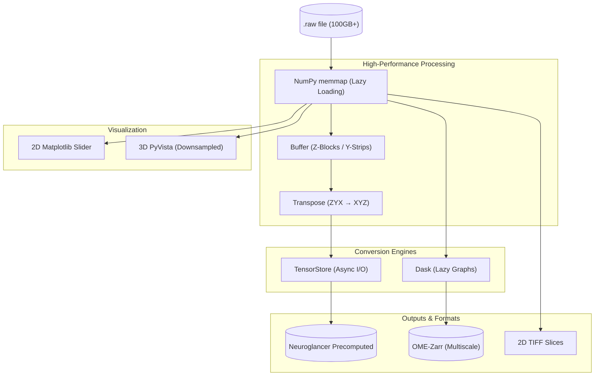

# Raw Converter Pipeline

**Developer:** Tahmeed Ahmad

A high-performance architecture for the conversion, extraction, and visualization of massive 3D volumetric raw datasets (e.g., Neuroimaging, CT/MRI). This pipeline is engineered to handle multi-hundred gigabyte volumes by prioritizing memory efficiency and parallel I/O.

---

## System Architecture & Data Flow

The architecture follows a "Stream-and-Transform" pattern. Instead of loading files into RAM, it uses virtual memory mapping to treat disk space as an array, applying transformations in-flight.

### Detailed Data Pipeline

### Transformation Logic (ZYX to XYZ)
Most raw volumetric data is stored in **ZYX** order (sequential slices). High-performance viewers like Neuroglancer require **XYZ** chunking for rapid random access across any plane. This pipeline handles the complex transposition and re-chunking efficiently:
1.  **Read**: Pulls a Z-block (e.g., 512 slices).
2.  **Strip**: Further divides into Y-strips to manage RAM.
3.  **Transpose**: Reorders coordinates into XYZ in small, CPU-cache-friendly chunks.
4.  **Write**: Commits to disk asynchronously.

---

## Deep Dive: File Descriptions

### 1. `convert-precomputed.py`
**The Neuroglancer Powerhouse.**
*   **Purpose**: Primarily used for converting massive raw volumes into the Neuroglancer Precomputed format.
*   **How it works**: It utilizes **TensorStore**, a library designed for reading and writing large multi-dimensional arrays. It implements a sophisticated triple-nested loop (Z-block -> Y-strip -> X-chunk) that ensures the machine's RAM is never overwhelmed, even when processing 300GB+ files. 
*   **Why TensorStore?**: It handles multiscale metadata automatically and performs parallelized, asynchronous writes to the file system, significantly reducing "bottleneck" time.

### 2. `raw_converter.py`
**The Cloud-Native Alternative.**
*   **Ram-consuming**: Takes ram equivalent/little extra to file size.
*   **Purpose**: Converts raw data into the **OME-Zarr** format, which is the industry standard for cloud-optimized bio-imaging data.
*   **How it works**: It wraps the raw memory-mapped data into a **Dask** array. Dask allows for "lazy" operations—defining a computation graph that only executes when data is written.
*   **Key Feature**: It uses an `ome-zarr` scaler to build a multiresolution pyramid (downsampled versions of the data), allowing viewers to load "zoomed-out" views instantly.

### 3. `extract-slice.py`
**The Feature Engineering Tool.**
*   **Purpose**: Sometimes 3D data needs to be processed as 2D images (e.g., for training a CNN or manual annotation). This script automates the extraction of every Z-slice from a volume.
*   **How it works**: It iterates through the Z-axis of the memory-mapped file and saves each 2D plane as a compressed TIFF using `tifffile`. This is a "safety-first" script that ensures data integrity is preserved during extraction.

### 4. `look.py`
**The Sentinel.**
*   **Purpose**: A lightweight utility to "look" into the data before committing to a long conversion process.
*   **How it works**: It performs a sparse scan of the volume (every 50th slice) and prints the maximum pixel values. 
*   **Use Case**: Essential for verifying that the raw file isn't empty (all zeros) or corrupted, and that the header dimensions provided match the actual file size.

### 5. `Raw-viewer.ipynb`
**The Interactive Lab.**
*   **Purpose**: A Jupyter Notebook designed for rapid data exploration.
*   **2D Browsing**: Uses `ipywidgets` to create a slider that lets you scroll through the 3D volume in real-time.
*   **3D Rendering**: Implements a **PyVista**-based volume renderer. To make 3D visualization possible in a browser, it applies "Massive Downsampling" (e.g., taking every 100th pixel), reducing 300GB volumes to ~10MB for instant 3D rotation and inspection.

---

## Performance Benchmarks (Typical)
*   **Memory Footprint**: Stabilized at ~5-8GB RAM regardless of input file size (100GB+).
*   **I/O Strategy**: Zero-copy reads using `numpy.memmap` and asynchronous concurrent writes using `TensorStore`.

## Use Cases
*   **High-Resolution Mapping**: Converting Lightsheet or Electron Microscopy data for web-based collaborative review.
*   **ML Data Pipelines**: Creating 2D training sets from 3D volumetric "ground truth" data.

---
**Developer & Architect:** [Tahmeed Ahmad](https://github.com/syedtahmeed12)
